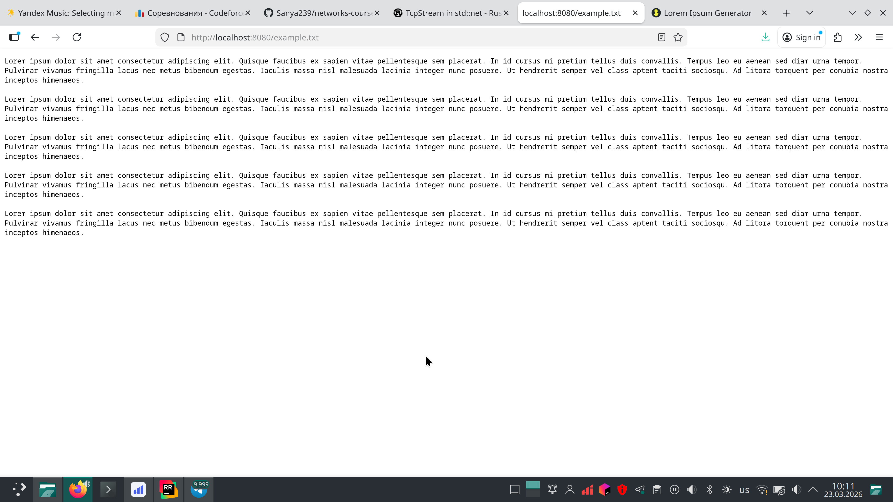
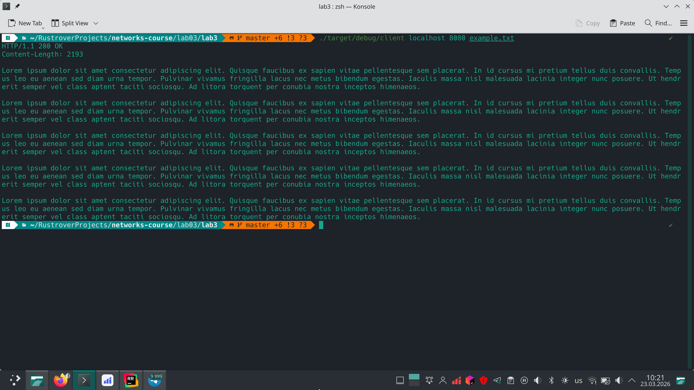
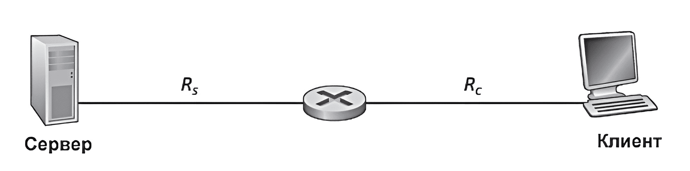
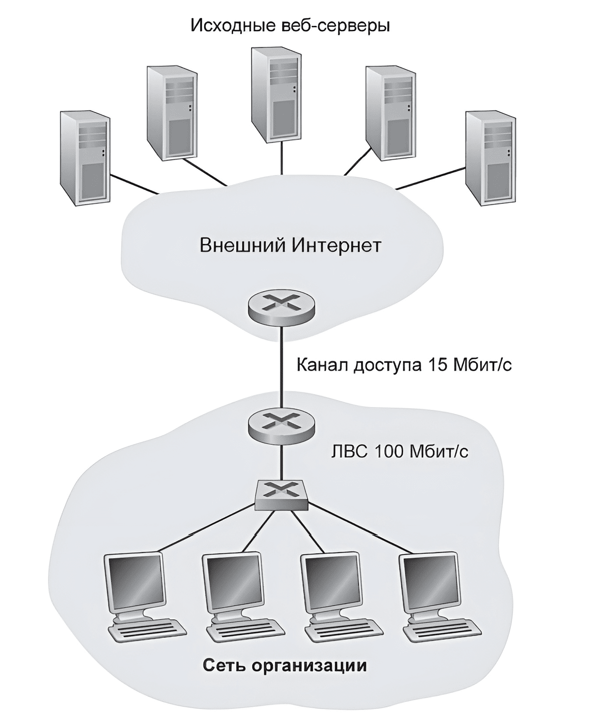

# Практика 3. Прикладной уровень

## Программирование сокетов. Веб-сервер

### А. Однопоточный веб-сервер (3 балла)

Вам необходимо разработать простой веб-сервер, который будет возвращать содержимое
локальных файлов по их имени. В этом задании сервер умеет обрабатывать только один запрос и
работает в однопоточном режиме. Язык программирования вы можете выбрать любой.
Требования:

- веб-сервер создает сокет соединения при контакте с клиентом (браузером) получает HTTP-запрос из этого соединения
- анализирует запрос, чтобы определить конкретный запрашиваемый файл
- находит запрошенный файл в своей локальной файловой системе
- создает ответное HTTP-сообщение, состоящее из содержимого запрошенного файла и предшествующих ему строк заголовков
- отправляет ответ через TCP-соединение обратно клиенту
- если браузер запрашивает файл, которого нет на веб-сервере, то сервер должен вернуть сообщение об ошибке «404 Not
  Found»

Ваша задача – разработать и запустить свой локальный веб-сервер, а затем проверить его
работу при помощи отправки запросов через браузер. Продемонстрируйте работу сервера, приложив скрины.

Скорее всего порт 80 у вас уже занят, поэтому вам необходимо использовать другой порт для
работы вашей программы.

Формат команды для запуска сервера:

```
<server.exe> server_port
```

#### Демонстрация работы
Запуск: 
```shell
cd lab03/solution
cargo run --bin server -- <port> <max_threads>  
# cargo run --bin server -- 8239 5
```


### Б. Многопоточный веб-сервер (2 балла)

Реализуйте многопоточный сервер, который мог бы обслуживать несколько запросов
одновременно. Сначала создайте основной поток (процесс), в котором ваш модифицированный
сервер ожидает клиентов на определенном фиксированном порту. При получении запроса на
TCP-соединение от клиента он будет устанавливать это соединение через другой порт и
обслуживать запрос клиента в отдельном потоке. Таким образом, для каждой пары запрос-ответ
будет создаваться отдельное TCP-соединение в отдельном потоке.

### В. Клиент (2 балла)

Вместо использования браузера напишите собственный HTTP-клиент для тестирования вашего
веб-сервера. Ваш клиент будет поддерживать работу с командной строкой, подключаться к
серверу с помощью TCP-соединения, отправлять ему HTTP-запрос с помощью метода GET и
отображать ответ сервера в качестве результата. Клиент должен будет в качестве входных
параметров принимать аргументы командной строки, определяющие IP-адрес или имя сервера,
порт сервера и имя файла на сервере. Продемонстрируйте работу клиента, приложив скрины.

Формат команды для запуска клиента:

```
<client.exe> server_host server_port filename
```

#### Демонстрация работы
Запуск:
```shell
cd lab03/solution
cargo run --bin client l<server_ip> <port> <filename>
# cargo run --bin client localhost 8080 example.txt
```



### Г. Ограничение потоков сервера (3 балла)

Пусть ресурсы вашего сервера ограничены и вы хотите контролировать максимальное количество
потоков, с которыми может работать ваш многопоточный сервер одновременно. При запуске
сервер получает целочисленное значение `concurrency_level` из командной строки. Если сервер
получает запрос от клиента, и при этом уже запущено максимальное количество потоков, то
запрос от клиента блокируется (встает в очередь) и дожидается, пока не закончит работу
один из запущенных потоков. После этого сервер может запустить новый поток для обработки
запроса от клиента.

Формат команды для запуска сервера:
```
<server.exe> server_port concurrency_level
```

## Задачи

### Задача 1 (2 балла)

Голосовые сообщения отправляются от хоста А к хосту Б в сети с коммутацией пакетов в режиме
реального времени. Хост А преобразует на лету аналоговый голосовой сигнал в цифровой поток
битов, имеющий скорость $128$ Кбит/с, и разбивает его на $56$-байтные пакеты. Хосты А и Б
соединены одной линией связи, в которой скорость передачи данных равна $1$ Мбит/с, а задержка
распространения составляет $5$ мс. Как только хост А собирает пакет, он посылает его на хост Б,
который, в свою очередь, при получении всего пакета преобразует биты в аналоговый сигнал.
Сколько времени проходит с момента создания бита (из исходного аналогового сигнала на хосте
A) до момента его декодирования (превращения в часть аналогового сигнала на хосте Б)?

#### Решение

Переведём все числа в биты: 128Кбит/с = 131072бит/с, 56Байт = 448бит, 1Мбит = 1048576бит.

Рассмотрим некоторый бит, пусть он i-й в своём пакете. Между его преобразованием в цифровой сигнал и преобразованием
обратно, происходят следущие вещи:

- 448-i бит преобращуются в цифровой сигнал
- Пакет передаётся между хостами
- i бит преобразуются в аналоговый сигнал.

Первый и третий этапы суммарно занимают $\frac{448}{131072} \approx 0.0034$с

Второй этап занимает $\frac{448}{1048576} + 0.005 \approx 0.0054$c

Итого, суммарно примерно 8.8 милисекунд

### Задача 2 (2 балла)

Рассмотрим буфер маршрутизатора, где пакеты хранятся перед передачей их в исходящую линию
связи. В этой задаче вы будете использовать широко известную из теории массового
обслуживания (или теории очередей) формулу Литтла. Пусть $N$ равно среднему числу пакетов в
буфере плюс пакет, который передается в данный момент. Обозначим через $a$ скорость
поступления пакетов в буфер, а через $d$ – среднюю общую задержку (т.е. сумму задержек
ожидания и передачи), испытываемую пакетом. Согласно формуле Литтла $N = a \cdot d$.
Предположим, что в буфере содержится в среднем $10$ пакетов, а средняя задержка ожидания для
пакета равна $10$ мс. Скорость передачи по линии связи составляет $100$ пакетов в секунду.
Используя формулу Литтла, определите среднюю скорость поступления пакета в очередь,
предполагая, что потери пакетов отсутствуют.

#### Решение

Задержка передачи 0.01с (потому что 100 пакетов в секунду). Значит $d=0.01+0.01 = 0.02$с

В очереди 10 пакетов, ещё 1 передаётся. Получается, $N=10+1=11$

$a = \frac{N}{d} = \frac{11}{0.02} = 550$пакетов в секунду

### Задача 3 (2 балла)

Рассмотрим рисунок.



Предположим, нам известно, что на маршруте от сервера до клиента узким местом
является первая линия связи, скорость передачи данных по которой равна $R_S$ бит/с.
Допустим, что мы отправляем два пакета друг за другом от сервера клиенту, и другой
трафик на маршруте отсутствует. Размер каждого пакета составляет $L$ бит, а скорость
распространения сигнала по обеим линиям равна $d_{\text{распространения}}$.

1. Какова временная разница прибытия пакетов к месту назначения? То есть, сколько
   времени пройдет от момента получения клиентом последнего бита первого пакета до
   момента получения последнего бита второго пакета?
2. Теперь предположим, что узким местом является вторая линия связи (то есть $R_C < R_S$).
   Может ли второй пакет находиться во входном буфере, ожидая передачи во вторую
   линию? Почему? Если предположить, что сервер отправляет второй пакет, спустя $T$ секунд
   после отправки первого, то каково должно быть минимальное значение $T$, чтобы очередь
   во вторую линию связи была нулевая? Обоснуйте ответ.

#### Решение

В первом случае, второй пакет проделывает такой же путь, как и первый, но стартует на $\frac{L}{R_S}$ позже. Так что это
и есть ответ$

Во втором случае, может возникнуть ситуация, что второй пакет уже целиком передан на средний узел, а первый ещё оттуда
не убыл. Тогда второй будет ожидать в очереди.
Второй пакет попадёт на маршрутизатор в середине через $\frac{L}{R_S} + T$ после первого. Чтобы первый пакет успел уйти,
должно выполниться $\frac{L}{R_S} + T > frac{L}{R_C}$. Получается, ответ $T > frac{L}{R_C} - \frac{L}{R_S} $

### Задача 4 (4 балла)



На рисунке показана сеть организации, подключенная к Интернету:
Предположим, что средний размер объекта равен $850000$ бит, а средняя скорость
запросов от браузеров этой организации к веб-серверам составляет $16$ запросов в секунду.
Предположим также, что количество времени, прошедшее с момента, когда внешний
маршрутизатор организации пересылает запрос HTTP, до момента, пока он не получит
ответ, равно в среднем три секунды. Будем считать, что общее среднее время ответа
равно сумме средней задержки доступа (то есть, задержки от маршрутизатора в
Интернете до маршрутизатора организации) и средней задержки в Интернете. Для
средней задержки доступа используем формулу $\dfrac{\Delta}{1 - \Delta \cdot B}$,
где $\Delta$ – это среднее время, необходимое для отправки объекта по каналу связи,
а B – частота поступления объектов в линию связи.

1. Найдите $\Delta$ (это среднее время, необходимое для отправки объекта по каналу связи).
2. Найдите общее среднее время ответа.
3. Предположим, что в локальной сети организации присутствует кэширующий
   сервер. Пусть коэффициент непопадания в кэш равен $0.4$. Найдите общее время ответа.

#### Решение

Будем считать что: либо запрос, либо ответ маленькие и передаются почти мгновенно, а задержек внутри маршрутизаторов
нет. Таким образом, достаточно посчитать время передачи данных в одну сторону

1. Время $\Delta$ это отношение размера объекта к пропускной способности самого слабого соединения в цепи.
   Это $\frac{850000}{15728640} = 0,0540415445963$c


2. Посчитаем среднюю задержку доступа по формуле $\dfrac{\Delta}{1 - \Delta \cdot B}$. В нашем случае $B=16$
   и $\Delta = 0,0540415445963$. Получается,
   задержка $\frac{0,0540415445963}{1-0,0540415445963\times16} = 0,399315995186$
   c. Чтобы вычислить полную задержку, нужно прибавить константу задержки в Интернете 3с. Ответ получается 3.4 сек.


3. Теперь считаем задержку с кэшем. Время отправки сообщения до маршрутизатора внутри
   компании $\frac{850000}{104857600} = 0,00810623168945$c. Тогда
   задержка $\frac{0,00810623168945}{1-0,00810623168945\times16}=0,0093142927274$с.

Итого, с учётом кэша имеем задержку $0.6\times0.009+0.4\times0.05 = 0,0254$с


