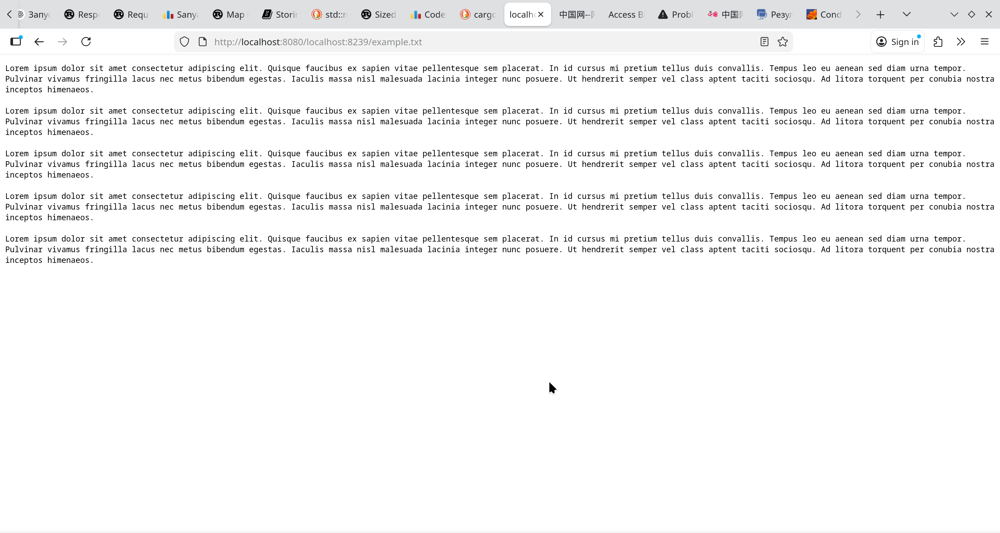
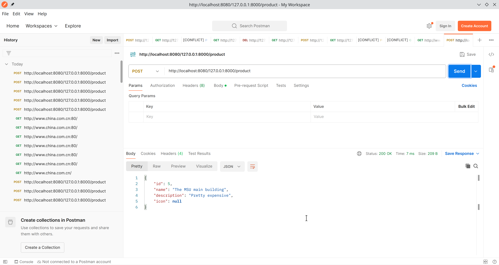
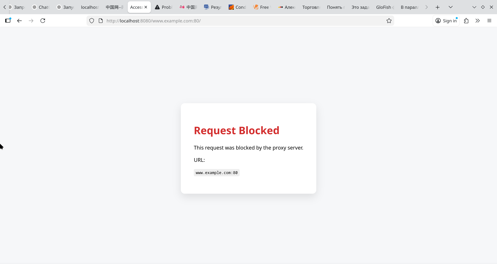
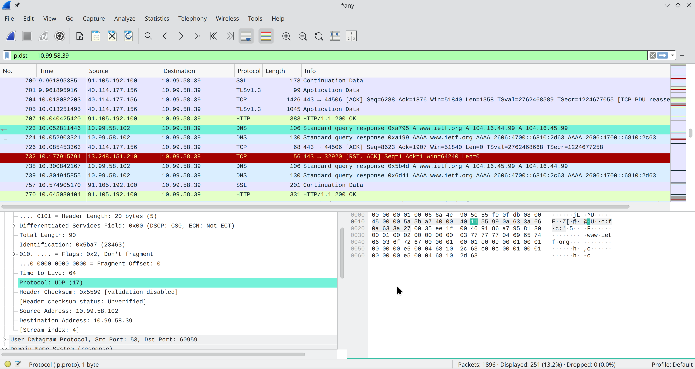
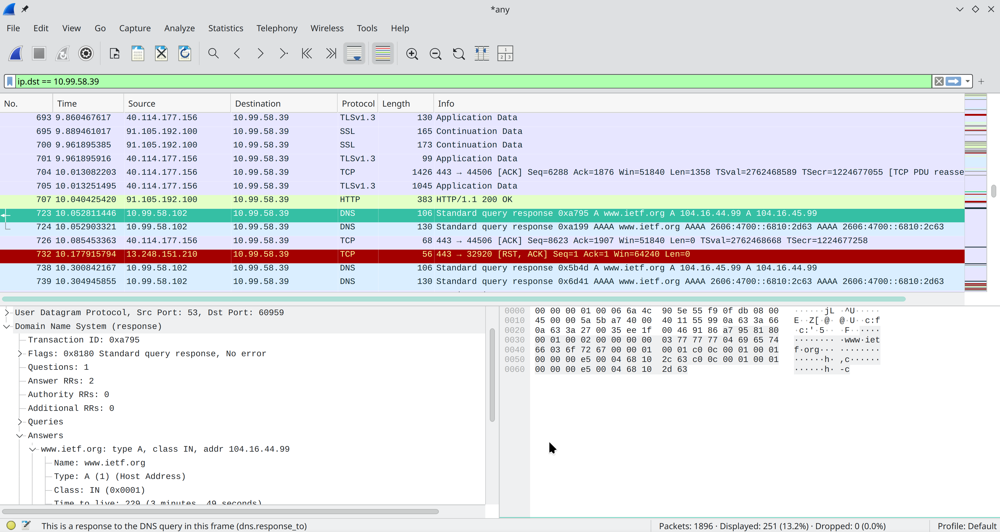
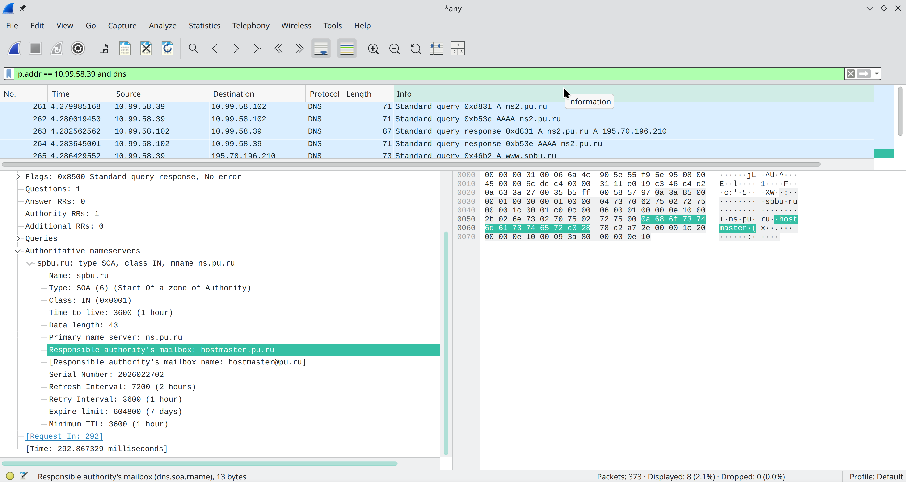

# Практика 4. Прикладной уровень

## Программирование сокетов: Прокси-сервер
Разработайте прокси-сервер для проксирования веб-страниц. 
Приложите скрины, демонстрирующие работу прокси-сервера. 

### Запуск прокси-сервера
Запустите свой прокси-сервер из командной строки, а затем запросите веб-страницу с помощью
вашего браузера. Направьте запросы на прокси-сервер, используя свой IP-адрес и номер порта.
Например, http://localhost:8888/www.google.com

_(*) Вы должны заменить стоящий здесь 8888 на номер порта в серверном коде, 
то есть тот, на котором прокси-сервер слушает запросы._

Вы можете также настроить непосредственно веб-браузер на использование вашего прокси сервера. 
В настройках браузера вам нужно будет указать адрес прокси-сервера и номер порта,
который вы использовали при запуске прокси-сервера (опционально).

### А. Прокси-сервер без кеширования (4 балла)
1. Разработайте свой прокси-сервер для проксирования http GET запросов от клиента веб-серверу 
   с журналированием проксируемых HTTP-запросов. В файле журнала сохраняется
   краткая информация о проксируемых запросах (URL и код ответа). Кеширование в этом
   задании не требуется. **(2 балла)**
2. Добавьте в ваш прокси-сервер обработку ошибок. Отсутствие обработчика ошибок может
   вызвать проблемы. Особенно, когда клиент запрашивает объект, который не доступен, так
   как ответ 404 Not Found, как правило, не имеет тела, а прокси-сервер предполагает, что
   тело есть и пытается прочитать его. **(1 балл)**
3. Простой прокси-сервер поддерживает только метод GET протокола HTTP. Добавьте
   поддержку метода POST. В запросах теперь будет использоваться также тело запроса
   (body). Для вызова POST запросов вы можете использовать Postman. **(1 балл)**




#### Демонстрация работы
todo

### Б. Прокси-сервер с кешированием (4 балла)
Когда прокси-сервер получает запрос, он проверяет, есть ли запрашиваемый объект в кэше, и,
если да, то возвращает объект из кэша без соединения с веб-сервером. Если объекта в кэше нет,
прокси-сервер извлекает его с веб-сервера обычным GET запросом, возвращает клиенту и
кэширует копию для будущих запросов.

Для проверки того, прокис объект в кеше или нет, необходимо использовать условный GET
запрос. В таком случае вам необходимо указывать в заголовке запроса значение для If-Modified-Since и If-None-Match. 
Подробности можно найти [тут](https://ruturajv.wordpress.com/2005/12/27/conditional-get-request).

Будем считать, что кеш-память прокси-сервера хранится на его жестком диске. Ваш прокси-сервер
должен уметь записывать ответы в кеш и извлекать данные из кеша (т.е. с диска) в случае
попадания в кэш при запросе. Для этого необходимо реализовать некоторую внутреннюю
структуру данных, чтобы отслеживать, какие объекты закешированы.

Приложите скрины или логи, из которых понятно, что ответ на повторный запрос был взят из кэша.

#### Демонстрация работы
todo

### В. Черный список (2 балла)
Прокси-сервер отслеживает страницы и не пускает на те, которые попадают в черный список. Вместо
этого прокси-сервер отправляет предупреждение, что страница заблокирована. Список доменов
и/или URL-адресов для блокировки по черному списку задается в **конфигурационном файле**.

Приложите скрины или логи запроса из черного списка.

#### Демонстрация работы
todo

## Wireshark. Работа с DNS
Для каждого задания в этой секции приложите скрин с подтверждением ваших ответов.

### А. Утилита nslookup (1 балл)

#### Вопросы
1. Выполните nslookup, чтобы получить IP-адрес какого-либо веб-сервера в Азии
   - Полагаю домен .jp находится в Азии
   ``` shell
   nslookup www.yahoo.co.jp
   Server:         10.99.58.102
   Address:        10.99.58.102#53
   
   Non-authoritative answer:
   www.yahoo.co.jp canonical name = edge12.g.yimg.jp.
   Name:   edge12.g.yimg.jp
   Address: 124.83.185.252 ```
2. Выполните nslookup, чтобы определить авторитетные DNS-серверы для какого-либо университета в Европе
   Есть отличный университет в Европе - Оксфорд. Команда:
   ```shell
      nslookup -type=ns ox.ac.uk
      Server:         10.99.58.102
      Address:        10.99.58.102#53
   
      Non-authoritative answer:
      ox.ac.uk        nameserver = auth6.dns.ox.ac.uk.
      ox.ac.uk        nameserver = dns0.ox.ac.uk.
      ox.ac.uk        nameserver = auth4.dns.ox.ac.uk.
      ox.ac.uk        nameserver = dns2.ox.ac.uk.
      ox.ac.uk        nameserver = dns1.ox.ac.uk.
      ox.ac.uk        nameserver = auth5.dns.ox.ac.uk.
   
      Authoritative answers can be found from:
      dns0.ox.ac.uk   internet address = 129.67.1.190
      dns1.ox.ac.uk   internet address = 129.67.1.191
      dns2.ox.ac.uk   internet address = 163.1.2.190
      auth4.dns.ox.ac.uk      internet address = 45.33.127.156
      auth5.dns.ox.ac.uk      internet address = 93.93.128.67
      auth6.dns.ox.ac.uk      internet address = 185.24.221.32
      auth4.dns.ox.ac.uk      has AAAA address 2600:3c00:e000:19::1
      auth5.dns.ox.ac.uk      has AAAA address 2a00:1098:0:80:1000::10
      auth6.dns.ox.ac.uk      has AAAA address 2a02:2770:11:0:21a:4aff:febe:759b 
      ```
3. Используя nslookup, найдите веб-сервер, имеющий несколько IP-адресов. Сколько IP-адресов имеет веб-сервер вашего учебного заведения?
   - Проверим гугл:
   ```shell
   nslookup www.google.com
   Server:         10.99.58.102
   Address:        10.99.58.102#53
   
   Non-authoritative answer:
   Name:   www.google.com
   Address: 142.251.154.119
   Name:   www.google.com
   Address: 142.251.157.119
   Name:   www.google.com
   Address: 142.251.153.119
   Name:   www.google.com
   Address: 142.251.152.119
   Name:   www.google.com
   Address: 142.251.151.119
   Name:   www.google.com
   Address: 142.251.155.119
   Name:   www.google.com
   Address: 142.251.150.119
   Name:   www.google.com
   Address: 142.251.156.119
   Name:   www.google.com
   Address: 2001:4860:4827:7700::
   Name:   www.google.com
   Address: 2001:4860:482a:7700::
   Name:   www.google.com
   Address: 2001:4860:482c:7700::
   Name:   www.google.com
   Address: 2001:4860:4828:7700::
   Name:   www.google.com
   Address: 2001:4860:4826:7700::
   Name:   www.google.com
   Address: 2001:4860:4829:7700::
   Name:   www.google.com
   Address: 2001:4860:482b:7700::
   Name:   www.google.com
   Address: 2001:4860:482d:7700::
   ```
   
   - Один ip-адрес
   ```shell
   nslookup -type=ns spbu.ru
   Server:         10.99.58.102
   Address:        10.99.58.102#53
   
   Non-authoritative answer:
   spbu.ru nameserver = ns.pu.ru.
   spbu.ru nameserver = ns7.spbu.ru.
   spbu.ru nameserver = ns2.pu.ru.
   
   Authoritative answers can be found from:
   ns7.spbu.ru     internet address = 185.44.15.195
   ```

### Б. DNS-трассировка www.ietf.org (3 балла)

#### Подготовка
1. Используйте ipconfig для очистки кэша DNS на вашем компьютере.
2. Откройте браузер и очистите его кэш (для Chrome можете использовать сочетание клавиш
   CTRL+Shift+Del).
3. Запустите Wireshark и введите `ip.addr == ваш_IP_адрес` в строке фильтра, где значение
   ваш_IP_адрес вы можете получить, используя утилиту ipconfig. Данный фильтр позволит
   нам отбросить все пакеты, не относящиеся к вашему хосту. Запустите процесс захвата пакетов в Wireshark.
4. Зайдите на страницу www.ietf.org в браузере.
5. Остановите захват пакетов.

#### Вопросы
1. Найдите DNS-запрос и ответ на него. С использованием какого транспортного протокола
   они отправлены?
   
   - Это протокол UDP
2. Какой порт назначения у запроса DNS?
   - Порт 53, видно внизу предыдущей картинки
3. На какой IP-адрес отправлен DNS-запрос? Используйте ipconfig для определения IP-адреса
   вашего локального DNS-сервера. Одинаковы ли эти два адреса?
   - Запрос был на 10.99.58.102, видно на всё той же картинке.
   - В системе как-то так:
   ```shell
   nmcli dev show | grep DNS
   IP4.DNS[1]:                             10.99.58.102
   IP6.DNS[1]:                             2a00:1fa0:c220:c859::6f
   ```
4. Проанализируйте сообщение-запрос DNS. Запись какого типа запрашивается? Содержатся
   ли в запросе какие-нибудь «ответы»?
   Картинка с ответом, запрос там выглядит аналогично
   
   - Запрос типа А
   - Нет никаких ответов  
5. Проанализируйте ответное сообщение DNS. Сколько в нем «ответов»? Что содержится в
   каждом?
   - Тут есть ответы:
      ```
     Answer RRs: 2
     Authority RRs: 0
     Additional RRs: 0
     ```
   - В каждом ответе есть имя, тип, класс, лайфтайм, дата и адрес
6. Посмотрите на последующий TCP-пакет с флагом SYN, отправленный вашим компьютером.
   Соответствует ли IP-адрес назначения пакета с SYN одному из адресов, приведенных в
   ответном сообщении DNS?
   - Нет, следующий SYN пакет вообще никакого отношения не имеет к этому соединению.
7. Веб-страница содержит изображения. Выполняет ли хост новые запросы DNS перед
   загрузкой этих изображений?
   - Есть ещё dns запросы.

### В. DNS-трассировка www.spbu.ru (2 балла)

#### Подготовка
1. Запустите захват пакетов с тем же фильтром `ip.addr == ваш_IP_адрес`
2. Выполните команду nslookup для сервера www.spbu.ru
3. Остановите захват
4. Вы увидите несколько пар запрос-ответ DNS. Найдите последнюю пару, все вопросы будут относиться к ней
   
#### Вопросы
1. Каков порт назначения в запросе DNS? Какой порт источника в DNS-ответе?
   - 53
   - 53
2. На какой IP-адрес отправлен DNS-запрос? Совпадает ли он с адресом локального DNS-сервера, установленного по умолчанию?
   - 10.99.58.102
   - Да, совпадает
3. Проанализируйте сообщение-запрос DNS. Запись какого типа запрашивается? Содержатся
   ли в запросе какие-нибудь «ответы»?
   - Запрос типа AAA
   - Нет ответов, это же запрос
4. Проанализируйте ответное сообщение DNS. Сколько в нем «ответов»? Что содержится в каждом?
   - Нет никаких ответов
   - В предпоследней паре сообщений есть один RR ответ: `spbu.ru: type A, class IN, addr 195.70.219.100`

### Г. DNS-трассировка nslookup –type=NS (1 балл)
Повторите все шаги по предварительной подготовке из Задания B, но теперь для команды `nslookup –type=NS spbu.ru`

#### Вопросы
1. На какой IP-адрес отправлен DNS-запрос? Совпадает ли он с адресом локального DNS-сервера, установленного по умолчанию?
   - 10.99.58.102
   - Да, совпадает
2. Проанализируйте сообщение-запрос DNS. Запись какого типа запрашивается? Содержатся ли в запросе какие-нибудь «ответы»?
   - Запись типа NS
   - Нет тут никаких ответов
3. Проанализируйте ответное сообщение DNS. Имена каких DNS-серверов университета в
   нем содержатся? А есть ли их адреса в этом ответе?
   - ns.pu.ru, ns2.pu.ru, ns7.spbu.ru
   - Есть адрес 185.44.15.195

### Д. DNS-трассировка nslookup www.spbu.ru ns2.pu.ru (1 балл)
Снова повторите все шаги по предварительной подготовке из Задания B, но теперь для команды `nslookup www.spbu.ru ns2.pu.ru`.
Запись `nslookup host_name dns_server` означает, что запрос на разрешение доменного имени `host_name` пойдёт к `dns_server`.
Если параметр `dns_server` не задан, то запрос идёт к DNS-серверу по умолчанию (например, к локальному).

#### Вопросы
1. На какой IP-адрес отправлен DNS-запрос? Совпадает ли он с адресом локального DNS-сервера, установленного по умолчанию? 
   Если нет, то какому хосту он принадлежит?
   - 195.70.196.210
   - Не совпадает, это и есть ns2.pu.ru
2. Проанализируйте сообщение-запрос DNS. Запись какого типа запрашивается? Содержатся
   ли в запросе какие-нибудь «ответы»?
   - Запрашивается AAAA
   - Ответов тут нет!
3. Проанализируйте ответное сообщение DNS. Сколько в нем «ответов»? Что содержится в
   каждом?
   - Один RR ответ
   - Написана какая-то информация про авторитетный сервер.
   

### Е. Сервисы whois (2 балла)
1. Что такое база данных whois?
   - WHOIS — это протокол и сервис, который позволяет узнать информацию о владельце доменного имени или IP-адреса
2. Используя различные сервисы whois в Интернете, получите имена любых двух DNS-серверов. 
   Какие сервисы вы при этом использовали?
   - ns1.yandexcloud.net - сервер емкн
   - ns1.yandex.ru - сервер личного кабинета ШАДа
   - Вот этот сервис https://www.whois.com/whois/
3. Используйте команду nslookup на локальном хосте, чтобы послать запросы трем конкретным
   серверам DNS (по аналогии с Заданием Д): вашему локальному серверу DNS и двум DNS-серверам,
   найденным в предыдущей части.
   ```shell
   nslookup shiroforbes.ru 10.99.58.102
   Server:         10.99.58.102
   Address:        10.99.58.102#53
   Non-authoritative answer:
   Name:   shiroforbes.ru
   Address: 178.250.243.28
   
   nslookup emkn.ru ns1.yandexcloud.net
   Server:         ns1.yandexcloud.net
   Address:        2a0d:d6c1:0:1a::1b4#53
   Name:   emkn.ru
   Address: 51.250.89.85

   nslookup ya.ru ns1.yandex.ru
   Server:         ns1.yandex.ru
   Address:        2a02:6b8::1#53
   Name:   ya.ru
   Address: 77.88.44.242
   Name:   ya.ru
   Address: 77.88.55.242
   Name:   ya.ru
   Address: 5.255.255.242
   Name:   ya.ru
   Address: 2a02:6b8::2:242
   ```
