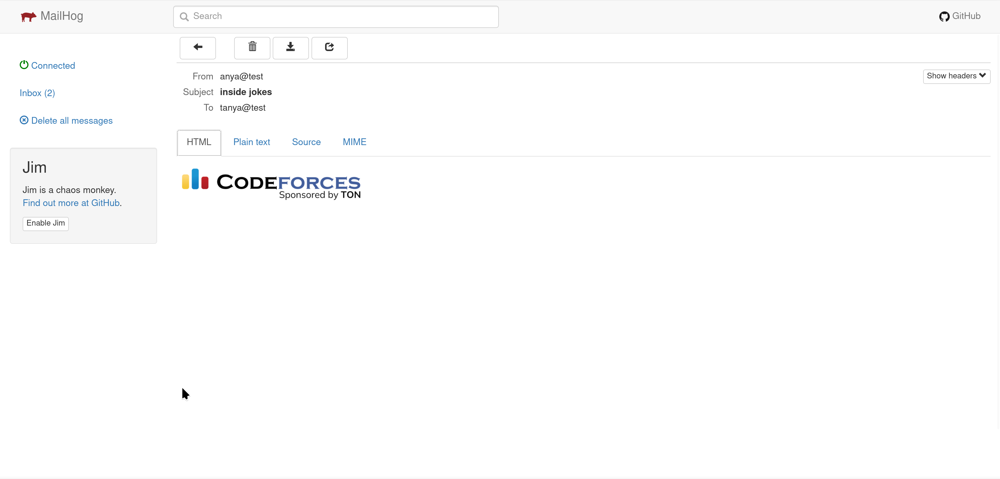
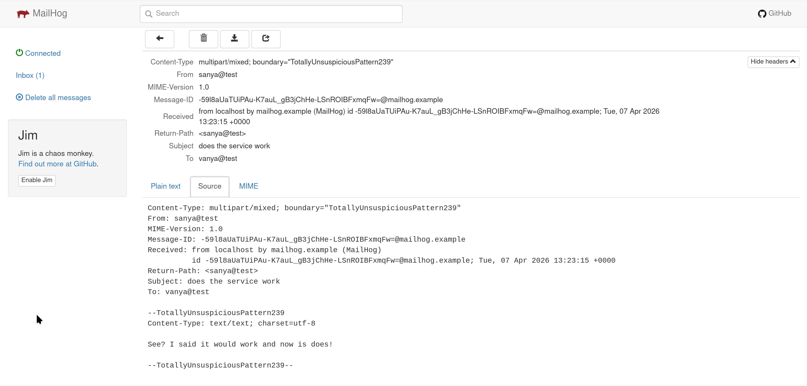
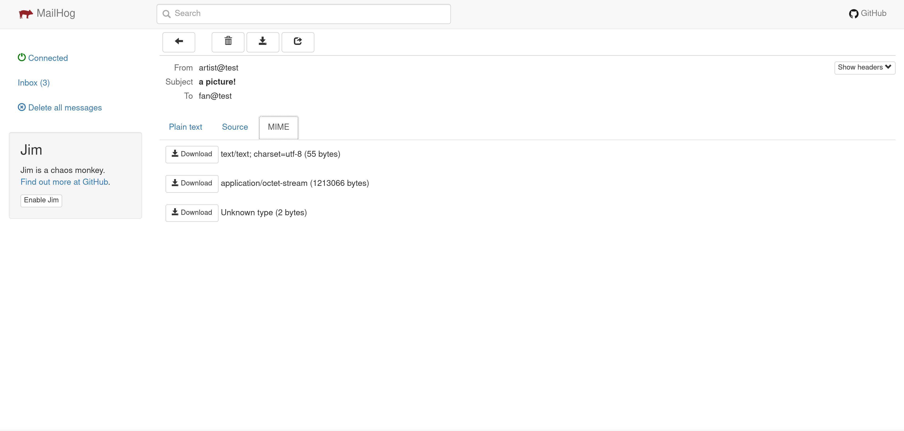
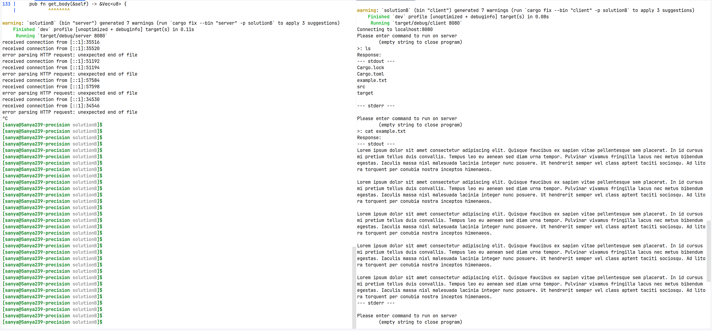
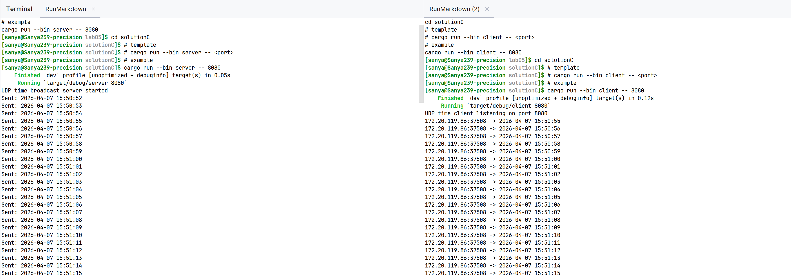

# Практика 5. Прикладной уровень

## Программирование сокетов.

### A. Почта и SMTP (7 баллов)

### 1. Почтовый клиент (2 балла)
Напишите программу для отправки электронной почты получателю, адрес
которого задается параметром. Адрес отправителя может быть постоянным. Программа
должна поддерживать два формата сообщений: **txt** и **html**. Используйте готовые
библиотеки для работы с почтой, т.е. в этом задании **не** предполагается общение с smtp
сервером через сокеты напрямую.

Приложите скриншоты полученных сообщений (для обоих форматов).

#### Демонстрация работы
Чтобы не тратить время на преодоление ssl сертификатов, письма посылаются на локальный почтовый сервис. Команда для его запуска:
```shell
docker run -p 1025:1025 -p 8025:8025 mailhog/mailhog
```
В этом решении порты захардкожены, поэтому менять их нельзя.

Команды для запуска программы:
```shell
cd solutionA
cargo run use_lettre
```


### 2. SMTP-клиент (3 балла)
Разработайте простой почтовый клиент, который отправляет текстовые сообщения
электронной почты произвольному получателю. Программа должна соединиться с
почтовым сервером, используя протокол SMTP, и передать ему сообщение.
Не используйте встроенные методы для отправки почты, которые есть в большинстве
современных платформ. Вместо этого реализуйте свое решение на сокетах с передачей
сообщений почтовому серверу.

Сделайте скриншоты полученных сообщений.


#### Демонстрация работы
Команды для запуска программы:
```shell
cd solutionA
cargo run
```


### 3. SMTP-клиент: бинарные данные (2 балла)
Модифицируйте ваш SMTP-клиент из предыдущего задания так, чтобы теперь он мог
отправлять письма с изображениями (бинарными данными).

Сделайте скриншот, подтверждающий получение почтового сообщения с картинкой.

#### Демонстрация работы
Команды для запуска программы:
```shell
cd solutionA
cargo run
```



### Б. Удаленный запуск команд (3 балла)
Напишите программу для запуска команд (или приложений) на удаленном хосте с помощью TCP сокетов.

Например, вы можете с клиента дать команду серверу запустить приложение Калькулятор или
Paint (на стороне сервера). Или запустить консольное приложение/утилиту с указанными
параметрами. Однако запущенное приложение **должно** выводить какую-либо информацию на
консоль или передавать свой статус после запуска, который должен быть отправлен обратно
клиенту. Продемонстрируйте работу вашей программы, приложив скриншот.

Например, удаленно запускается команда `ping yandex.ru`. Результат этой команды (запущенной на
сервере) отправляется обратно клиенту.

#### Демонстрация работы
Команды для запуска сервера:
```shell
cd solutionB
# template
# cargo run --bin server -- <port>

# example
cargo run --bin server -- 8080
```

Команды для запуска клиента:
```shell
cd solutionB
# template
# cargo run --bin client -- <port>

# example
cargo run --bin client -- 8080

# commands to try:
# cat example.txt
# ping ya.ru -c 5
# cd ../.. && ls
```


### В. Широковещательная рассылка через UDP (2 балла)
Реализуйте сервер (веб-службу) и клиента с использованием интерфейса Socket API, которая:
- работает по протоколу UDP
- каждую секунду рассылает широковещательно всем клиентам свое текущее время
- клиент службы выводит на консоль сообщаемое ему время

#### Демонстрация работы
Команды для запуска сервера:
```shell
cd solutionC
# template
# cargo run --bin server -- <port>

# example
cargo run --bin server -- 8080
```

Команды для запуска клиента:
```shell
cd solutionC
# template
# cargo run --bin client -- <port>

# example
cargo run --bin client -- 8080
```


## Задачи

### Задача 1 (2 балла)
Рассмотрим короткую, $10$-метровую линию связи, по которой отправитель может передавать
данные со скоростью $150$ бит/с в обоих направлениях. Предположим, что пакеты, содержащие
данные, имеют размер $100000$ бит, а пакеты, содержащие только управляющую информацию
(например, флаг подтверждения или информацию рукопожатия) – $200$ бит. Предположим, что у
нас $10$ параллельных соединений, и каждому предоставлено $1/10$ полосы пропускания канала
связи. Также допустим, что используется протокол HTTP, и предположим, что каждый
загруженный объект имеет размер $100$ Кбит, и что исходный объект содержит $10$ ссылок на другие
объекты того же отправителя. Будем считать, что скорость распространения сигнала равна
скорости света ($300 \cdot 10^6$ м/с).
1. Вычислите общее время, необходимое для получения всех объектов при параллельных
непостоянных HTTP-соединениях
2. Вычислите общее время для постоянных HTTP-соединений. Ожидается ли существенное
преимущество по сравнению со случаем непостоянного соединения?

#### Решение
В этой задаче будут округления. 

Скажем, что 100Кбит это 100000би (не 102400 как можно было бы подумать). Тогда каждый объект влезает ровно в 1 пакет. Всего нужно отправить 11 пакетов - объект и 10 ссылок внутри него.

Разберёмся с задержкой распостранения. Длина линии 10 метров, скорость света $300 \cdot 10^6$ м/с. Получается пакет проходит линию примерно за 33 наносекунды. Пакетов всего 11, поэтому такая ничтожная задержка не поменяет ответ обсолютно никак.

Скорость передачи данных в одном соединении 150/10=15бит/с. Таким образом, служебный пакет будет передаваться 13.33 сек. Даннные на самом деле не влезут в 1 пакет, ведь там ещё должна поместиться служебная информация - поэтому будет два пакета, суммарный размер которых 100400бит, это передастся за 6693.33 сек.

При каждой установке соединения будут кинуты пакеты: SYN, SYN ACK, ACK, Request. Это 53.33 сек служебной информации на каждое соединение.

Так как у нас 10 каналов, после получения основного объекта, всё остальное можно загружать одновременно.

Полное время передачи: 53.33(установить соединение) + 6693.33(передать объект) + 53.33(установить соединение повторно) + 6693.33(передать остальные объекты) = 13973 сек.

Если не прерывать соединение, времени потратится на 53.33 сек меньше - эта оптимизация незначительная по сравнению со временем передачи.

### Задача 2 (3 балла)
Рассмотрим раздачу файла размером $F = 15$ Гбит $N$ пирам. Сервер имеет скорость отдачи $u_s = 30$
Мбит/с, а каждый узел имеет скорость загрузки $d_i = 2$ Мбит/с и скорость отдачи $u$. Для $N = 10$, $100$
и $1000$ и для $u = 300$ Кбит/с, $700$ Кбит/с и $2$ Мбит/с подготовьте график минимального времени
раздачи для всех сочетаний $N$ и $u$ для вариантов клиент-серверной и одноранговой раздачи.

#### Решение
todo

### Задача 3 (3 балла)
Рассмотрим клиент-серверную раздачу файла размером $F$ бит $N$ пирам, при которой сервер
способен отдавать одновременно данные множеству пиров – каждому с различной скоростью,
но общая скорость отдачи при этом не превышает значения $u_s$. Схема раздачи непрерывная.
1. Предположим, что $\dfrac{u_s}{N} \le d_{min}$.
   При какой схеме общее время раздачи будет составлять $\dfrac{N F}{u_s}$?
2. Предположим, что $\dfrac{u_s}{N} \ge d_{min}$. 
   При какой схеме общее время раздачи будет составлять  $\dfrac{F}{d_{min}}$?
3. Докажите, что минимальное время раздачи описывается формулой $\max\left(\dfrac{N F}{u_s}, \dfrac{F}{d_{min}}\right)$?

#### Решение
1. При равномерное схеме время передачи составит $\dfrac{N F}{u_s}$. Серверу в любом случае нужно отправить $N$ копий файла, так что быстрее не получится.

2. Теперь рассылаем файл всем пирам со скоростью приёма самого медленного. Теперь самый медленный пир должен загрузить $F$ бит со скоростью $d_{min}$. Явно не получится быстрее чем за $\dfrac{F}{d_{min}}$.

3. И вот мы по результатам двух пунктов знаем, что в первом случае времени потратится не меньше чем $\dfrac{N F}{u_s}$. При этом, в этом случае $\dfrac{N F}{u_s} < \dfrac{F}{d_{min}}$.
Во втором случае, времени нужно хотя бы $\dfrac{F}{d_{min}}$, но теперь $\dfrac{F}{d_{min}} < \dfrac{N F}{u_s}$. Значит всегда хотя бы $\max\left(\dfrac{N F}{u_s}, \dfrac{F}{d_{min}}\right)$.
